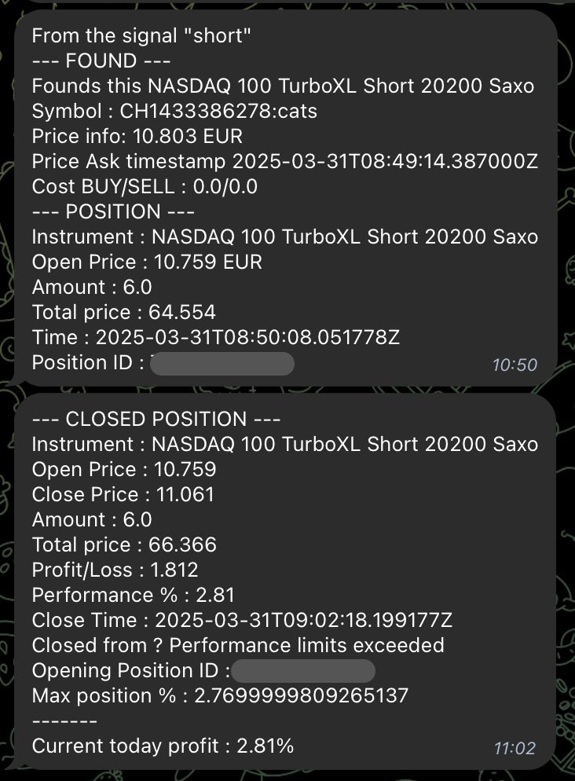

<div align="center">
    <a href="https://ioiti.github.io/wata-docs/">
        
    </a>
    <h1 style="margin-left: 20px; margin-top: 0; margin-bottom: 2;">WATA - Warrants Automated Trading Assistant</h1>
    <p>Automated trading system for Saxo Bank's Knock-out warrants (Turbos), executing trades via webhook signals.</p>
</div>


<p align="center">
  
  
  
  
  
  
</p>
<p align="center">
  <a href="https://github.com/IOITI/wata/stargazers"></a>
  <a href="https://github.com/IOITI/wata/forks"></a>
</p>

<div align="center">
  <H2><a href="https://ioiti.github.io/wata-docs/docs/intro">📚Documentation Website</a></H2>
</div>

---

> [!WARNING]
> 
> **This is a personal learning project and not production-ready software.**
> 
>  Do not risk money you cannot afford to lose. USE THE SOFTWARE AT YOUR OWN RISK. THE AUTHORS AND ALL AFFILIATES ASSUME NO RESPONSIBILITY FOR YOUR TRADING RESULTS.
>
> Always start by running WATA with small money amounts to test the system and its performance. Use a secondary Saxo account if possible. Understand the risks involved in trading before you start, and do not engage money before you understand how it works and what profit/loss you should expect.
>
> **Risk Warning: WATA CAN LOSE ALL YOUR MONEY due to:**
> - Insufficient code testing
> - Limited security measures on your server
> - Lack of fail-safe mechanisms
> - No comprehensive monitoring included
> - Absence of fail-over systems
> - Limited user experience
> - Change of Saxo Bank API
> - Because trading with leverage is very risky
> 
> *This software is provided "as is" without warranty. The authors accept no liability for any damages arising from its use.*

## 🎯 Purpose

WATA (Warrants Automated Trading Assistant) is an algorithmic trading system compagnon, designed for automated execution of Knock-out warrants (Turbos) on Saxo Bank. It serves as a reliable bridge between trading signals and actual market execution, offering several key benefits:

- **Automated Execution**: Eliminates emotional bias and human error by executing trades based on predefined rules and signals (from TradingView, for example)
- **Risk Management**: Implements systematic position monitoring with stop-loss and take-profit mechanisms
- **Performance Tracking**: Provides comprehensive analytics and reporting for trade analysis
- **Real-time Monitoring**: Delivers instant notifications via Telegram for trade execution and system status
- **Scalability**: Built on a microservice architecture for reliable and maintainable operation

The system is particularly suited for traders who:
- Want to automate their trading strategies
- Need reliable execution of trading signals
- Require comprehensive trade tracking and analysis
- Value real-time monitoring and alerts
- Prefer systematic, rule-based trading over discretionary decisions

## 🏗️ Architecture

WATA uses a microservice architecture with:

| Component (roles) | Purpose                                                       |
|-------------------|---------------------------------------------------------------|
| **Web Server**    | Receives webhook signals from third party (like: TradingView) |
| **Trader**        | Executes Saxo Bank API operations                             |
| **Scheduler**     | Manages job orchestrations                                    |
| **Telegram**      | Delivers notifications and alerts                             |
| **RabbitMQ**      | Handles inter-component messaging                             |

```mermaid
flowchart TD
    %% Styling
    classDef external fill:#f9f9f9,stroke:#aaa,stroke-width:1px,color:#000
    classDef processing fill:#e1f5fe,stroke:#03a9f4,stroke-width:1px,color:#000
    classDef execution fill:#e8f5e9,stroke:#4caf50,stroke-width:1px,color:#000
    classDef jobs fill:#fff8e1,stroke:#ffc107,stroke-width:1px,color:#000
    classDef database fill:#f3e5f5,stroke:#9c27b0,stroke-width:2px,stroke-dasharray: 5 5,color:#000
    classDef reporting fill:#ffebee,stroke:#f44336,stroke-width:1px,color:#000
    
    %% External Systems
    subgraph ExtSys["🌐 External Systems"]
        direction LR
        TV("🖥️ TradingView/<br>Signal Source")
        SB("🏦 Saxo Bank API")
        User("👤 User/Trader")
        TG("📱 Telegram Service")
    end
    
    %% WATA Core Services
    subgraph CoreSys["⚙️ WATA Core Services"]
        direction TB
        
        subgraph SigProc["📡 Signal Processing"]
            direction LR
            WS("🔌 Web Server")
            RMQ("📨 RabbitMQ<br>Message Broker")
        end
        
        subgraph ExecEng["💹 Execution Engine"]
            direction LR
            TR("💱 Trader Service")
            DB[("💾 DuckDB")]:::database
        end
        
        subgraph JobSvc["⏱️ Jobs Orchestration"]
            SC("🔄 Scheduler")
        end
    end
    
    %% Reporting System
    subgraph RepSys["📊 Local Reporting System"]
        direction LR
        EX("🔄 Data Export")
        OD("📈 Observable<br>Dashboard")
    end
    
    %% Connections with styled arrows
    TV -- "1️⃣ Webhook Signal" --> WS
    WS -- "2️⃣ Signal Message" --> RMQ
    RMQ -- "3️⃣ Position Request" --> TR
    TR -- "Authentication" --> SB
    User -- "Auth Code" --> TR
    TR -- "4️⃣ Trading Operations" --> SB
    TR -- "Send Notification" --> RMQ
    RMQ -- "Notification Request" --> TG
    TG -- "5️⃣ Notifications" --> User
    TR <-- "Position Data" --> DB
    SC -- "Periodic Tasks" --> RMQ
    RMQ -- "Status Tasks" --> TR
    TR <-- "Performance Data" --> DB
    DB -. "6️⃣ Manual Data Sync" .-> EX
    EX -. "Data Transform" .-> OD
    OD -. "7️⃣ Performance<br>Visualization" .-> User
    
    %% Apply styles
    class TV,SB,User,TG external
    class WS,RMQ processing
    class TR,DB execution
    class SC jobs
    class EX,OD reporting
```




## 📊 Trading Workflow

1. **Signal Reception**
   - Validate incoming webhooks (authentication, schema)
   - Parse action type (long, short, close)

2. **Rule Validation**
   - Verify market hours, timestamp freshness
   - Check allowed indices and position duplicates
   - Apply daily profit limits

3. **Trade Execution**
   - For new positions: instrument search, order calculation, position confirmation
   - For closing: position retrieval, order creation, performance reporting
   - Automatic position monitoring with stop-loss/take-profit handling

4. **Performance Tracking**
   - Daily statistics generation
   - Performance metrics reporting
   - Database storage for analysis



## 💾 Database System

WATA uses DuckDB for fast in-memory analytics:

- **Order tracking**: Complete order and positions history with execution details
- **Position management**: P&L calculations and performance metrics 
- **Performance analytics**: Daily statistics and trading history
- **Advantages**: High-speed analytics, corruption prevention, SQL support

## 🔐 Authentication and Security

### Saxo Bank API Authentication

WATA uses OAuth 2.0 for Saxo Bank API integration:

1. When authenticating, the application send you a URL via Telegram (or logs of container)
2. Open this URL in your browser and log in with your Saxo credentials, and do all the steps to authorize the application (2FA, risk warning, etc.)
3. After authorization, you'll be redirected to a page with a URL containing a `code` parameter
4. Copy the code and run `watasaxoauth` on your server (you will be prompted to enter the code securely)
5. The application completes authentication using this code

**Command Reference**:
- `watasaxoauth`: Run this command and you'll be prompted to enter the authorization code securely (the code won't be visible when typing)
- The authorization code is valid only for a short time (typically a few minutes)

Please refer to the [dedicated docs pages for Saxo Authentication](https://ioiti.github.io/wata-docs/docs/saxo-authentication) for more details.

### Webhook Security

WATA uses token-based authentication to secure webhook endpoints:

1. Each webhook request must include a valid token in the URL (e.g., `/webhook?token=YOUR_TOKEN`)
2. This token is securely generated and stored with strong encryption
3. Manage your webhook token with the `watawebtoken` command

**Command Reference**:
- `watawebtoken`: View your current webhook token
- `watawebtoken --new`: Generate a new webhook token
- The command provides instructions on how to use the token in your webhook URL

**Security Features**:
- All tokens are encrypted before storage
- File permissions are restricted to the owner only
- IP address filtering adds an additional layer of security

## 📖 Detailed How-To Guide

For a comprehensive, step-by-step guide on setting up and using WATA, including:
- Detailed prerequisites and estimated costs
- Setting up Saxo Bank integration
- Configuring Telegram notifications
- Deploying and configuring WATA
- Setting up TradingView webhooks
- Starting and monitoring your trading

Please refer to our detailed [HOW-TO Guide](https://ioiti.github.io/wata-docs/docs/how-to).

## 🚀 Setup & Deployment

### Prerequisites

   - Saxo Bank account with API access
   - Dedicated Ubuntu server (on VPS or local machine)
   - Docker and Docker Compose installed
   - Python 3.12+
   - Ansible (for automated deployment)
   - Telegram bot for notifications
   - _(Optional) TradingView account for webhook signals_

### Detailed Setup

For detailed setup instructions, refer to our [HOW-TO Guide](https://ioiti.github.io/wata-docs/docs/how-to).

### Quick Start

1. **Configure Inventory**
   - Copy the example Ansible inventory file:
     ```bash
     cp deploy/tools/ansible/inventory/inventory_example.ini deploy/tools/ansible/inventory/inventory.ini
     ```
   - Edit `inventory.ini` with your server details

2. **Build Application**
   - Build the package:
     ```bash
     ./package.sh
     ```

3. **Deploy Application**
   - Run the deployment script:
     ```bash
     cd deploy/tools
     ./deploy_app_to_your_server.sh
     ```
   - The script will use Ansible to deploy the application to your server

4. **Configure Application**
   - On the server, set up your credentials in `etc/config.json` (see below in Configuration section)

5. **Manage Application**
   Use the following aliases on your server:
   - `watastart`: Start the application
   - `watastop`: Stop the application
   - `watalogs`: View application logs
   - `watastatus`: Check application status
   - `watasaxoauth`: Launch the secure authorization code submission process
   - `watawebtoken`: View your webhook authentication token
   - `watawebtoken --new`: Generate a new webhook token


### Docker Compose Setup

The application uses Docker Compose with an override file for enhanced configuration:

1. **Environment Variables**
   - The system uses a `.env` file in the `deploy` directory to manage sensitive configuration.
   - The primary use is for setting the RabbitMQ password which is then synchronized with your config.json.

2. **Service Dependencies**
   - A special `setup` service runs before other services to ensure configuration is properly synchronized.
   - This setup updates the RabbitMQ password in your config.json file to match the one set in your .env file.
   - All other services (web_server, trader, scheduler, telegram) depend on both the setup service and the RabbitMQ service.

### Configuration

After deployment, you need to set up your configuration:

1. **Configure RabbitMQ Password**
   ```bash
   # Navigate to the deploy directory
   cd /app/deploy
   
   # Copy the example .env file
   cp .env.example .env
   
   # Edit the .env file to set your custom RabbitMQ password
   nano .env
   ```
   
   This sets the password used by RabbitMQ and automatically updates your config.json file through the setup service in docker-compose.

2. **Copy the Example Config**
   ```bash
   cp /app/etc/config_example.json /app/etc/config.json
   ```

3. **Update Configuration**
   Edit `/app/etc/config.json` with your specific settings:

   - **Saxo Bank Authentication**
     ```json
     "authentication": {
       "saxo": {
         "app_config_object": {
           "AppName": "your_app_name",
           "AppKey": "your_app_key",
           "AppSecret": "your_app_secret"
         }
       }
     }
     ```

   - **WebServer Security**
     ```json
     "webserver": {
       "persistant": {
         "token_path": "/app/var/lib/web_server/persist_token.json"
       },
       "app_secret": "YOUR_STRONG_SECRET_KEY"
     }
     ```

   - **Telegram Notifications**
     ```json
     "telegram": {
       "bot_token": "your_bot_token",
       "chat_id": "your_chat_id",
       "bot_name": "your_bot_name"
     }
     ```

   - **Trading Rules**
     - `allowed_indices`: Configure allowed trading indices
     - `market_closed_dates`: Set market holidays
     - `day_trading`: Define profit targets and limits

   - **Other Settings**
     - Logging configuration
     - RabbitMQ connection details
     - DuckDB database path

   For a complete and detailed explanation of all configuration options, please refer to the [CONFIGURATION Guide](https://ioiti.github.io/wata-docs/docs/configuration).

4. **Restart Services**
   ```bash
   watastop
   watastart
   ```

### Usage

Send trading signals to:
```
POST /webhook?token=YOUR_SECRET_TOKEN
```

Payload:
```json
{
  "action": "long",
  "indice": "us100",
  "signal_timestamp": "2023-07-01T12:00:00Z",
  "alert_timestamp": "2023-07-01T12:00:01Z"
}
```

## 📈 Reporting

WATA includes a visualization dashboard built on Observable Framework:

- Daily/cumulative profit tracking
- Performance analysis by action type
- Win-rate and position duration metrics
- Interactive data exploration


_(yeah, I'm still loosing money... but at least ... I know how much !)_

### Requirements

To use the reporting system, you need:
- Node.js and npm installed
- DuckDB CLI installed
- Python 3.12+ (with required libraries `./reporting/requirements.txt`)
- Ansible configured with proper inventory (same as deployment stage)

### Setting Up the Dashboard

1. **Run the Setup Script**
   ```bash
   ./reporting/setup_dashboard.sh
   ```
   This script creates a new Observable Framework project in `reporting/trading-dashboard`.

2. **Sync Trading Data**
   ```bash
   ./reporting/sync_reporting_data.sh
   ```
   This script synchronizes your trading data from the server to your local dashboard:
   - Fetches DuckDB data from your production server
   - Exports the database to Parquet format
   - Generates the necessary JSON files for visualization
   - Copies all data to the Observable Framework project

3. **Start the Dashboard Server**
   ```bash
   ./reporting/start_report_server.sh
   ```
   This launches the development server on port 4321.
   Access the dashboard at: http://localhost:4321

## ❓ Frequently Asked Questions

Here are some of the most common questions about WATA:

### General
- **Is WATA suitable for beginners?**  
  WATA requires understanding of trading concepts, Python, and server management. It's recommended for users with intermediate technical skills.

### Trading
- **What markets can I trade with WATA?**  
  WATA supports trading Knock-out warrants (Turbos) available on Saxo Bank, primarily focusing on major indices.

### Setup
- **What are the minimum server requirements?**  
  A basic VPS with 2GB RAM, 50GB SSD, 2 core CPU should be sufficient for getting started.

For a comprehensive list of questions and answers, please see our detailed [FAQ documentation](https://ioiti.github.io/wata-docs/docs/faq).

## 🔍 Troubleshooting

This section provides solutions to common issues you might encounter while setting up or running WATA.

### Saxo Bank API Authentication

-   **Invalid/Expired Authorization Code**: If you receive an error message about an invalid or expired authorization code during the `watasaxoauth` process, try the following:
    *   Ensure you are copying the entire code correctly from the redirect URL.
    *   The authorization code is short-lived (typically a few minutes). Generate a new URL and try the process again promptly.
    *   Check your system clock to ensure it's synchronized, as significant time differences can sometimes affect OAuth 2.0 flows.
-   **Timeout Waiting for Authorization Code**: This error indicates that the `watasaxoauth` command did not receive the authorization code within its 5-minute waiting period.
    *   Ensure you are pasting the code into the correct terminal prompt.
    *   If running WATA on a remote server, ensure your SSH session is stable.
-   **"Invalid Grant" or Similar Authentication Errors After Successful Setup**:
    *   This might indicate that the refresh token has expired or been revoked. You may need to re-run the `watasaxoauth` process to obtain a new set of tokens.
    *   Verify that the AppKey and AppSecret in your `config.json` match exactly with what Saxo Bank provided for your application.

### Docker & Deployment

-   **Docker Daemon Not Running**: Ensure the Docker service is active on your server. You can usually check with `sudo systemctl status docker` and start it with `sudo systemctl start docker`.
-   **Port Conflicts**: If a service fails to start due to a port already being in use (e.g., for RabbitMQ or the Web Server):
    *   Identify the conflicting service using `sudo netstat -tulnp | grep <port_number>`.
    *   Either stop the conflicting service or change the port WATA uses in the `docker-compose.yml` and relevant `config.json` settings.
-   **Build Failures (`./package.sh` or `docker-compose build`)**:
    *   Check for detailed error messages in the build logs.
    *   Ensure you have a stable internet connection to download dependencies.
    *   Make sure Docker has sufficient resources (CPU, RAM, disk space).
-   **Containers Not Starting or Restarting**:
    *   Use `watalogs` or `docker logs <container_name>` (e.g., `docker logs wata-trader-1`) to check for specific error messages.
    *   Verify all necessary configuration files (e.g., `config.json`, `.env`) are present and correctly formatted.
    *   Ensure RabbitMQ is running before other services that depend on it. The `setup` service in Docker Compose should handle this, but manual checks can be useful.

### Application Configuration

-   **Incorrect `config.json` Format**: If the application fails to start or behaves unexpectedly, validate your `config.json` file.
    *   Ensure it's valid JSON. You can use an online JSON validator.
    *   Double-check all required fields are present as per `config_example.json`.
    *   Pay attention to commas, brackets, and quotes.
-   **Missing Credentials**: Ensure all sensitive information like API keys, tokens, and passwords are correctly entered in `config.json` and the `deploy/.env` file for RabbitMQ.
-   **Webhook Token Issues**:
    *   If webhook signals are not being processed, verify that the token in your TradingView alert matches the one generated by `watawebtoken`.
    *   Ensure the `web_server` component is running and accessible from TradingView's IP addresses.

### General Tips

-   **Check Logs**: The first step in troubleshooting is always to check the logs. Use `watalogs` (which aggregates logs from all services) or `docker logs <container_name>` for individual service logs.
-   **Restart Services**: Sometimes, a simple restart can resolve transient issues: `watastop` followed by `watastart`.
-   **Consult Documentation**: Refer to the [detailed documentation website](https://ioiti.github.io/wata-docs/) for more in-depth explanations of components and configurations.
-   **Check System Resources**: Ensure your server has enough RAM, CPU, and disk space available.

If you encounter an issue not listed here, consider [reporting an issue](https://github.com/IOITI/wata/issues) with detailed logs and steps to reproduce.

## 🤝 Acknowledgements

- [@hootnot](https://github.com/hootnot): [Saxo OpenAPI library](https://github.com/hootnot/saxo_openapi)
- [Observable Framework](https://observablehq.com/framework), [DuckDB](https://duckdb.org/), [FastAPI](https://fastapi.tiangolo.com/), [RabbitMQ](https://www.rabbitmq.com/), [Ansible](https://www.ansible.com/)

## 🛠️ Contributors

- [@ioiti](https://github.com/IOITI): Project author and maintainer
- [@hootnot](https://github.com/hootnot): [Saxo OpenAPI library](https://github.com/hootnot/saxo_openapi)

## 🛠️ How to Contribute

We welcome contributions to WATA! Whether you're fixing a bug, improving documentation, or proposing a new feature, your help is appreciated. Please follow these guidelines to make the process smoother for everyone.

### Reporting Issues

- **Check Existing Issues**: Before submitting a new issue, please search the existing issues (open and closed) to see if your problem or suggestion has already been reported.
- **Provide Detailed Information**: When reporting an issue, especially a bug, include as much detail as possible:
    - Steps to reproduce the bug.
    - Expected behavior and what actually happened.
    - Your WATA version, operating system, and relevant environment details.
    - Any error messages or logs.
- **Use Issue Templates**: If available, use the provided issue templates (e.g., for bug reports or feature requests).

### Submitting Pull Requests

- **Fork the Repository**: Start by forking the repository to your own GitHub account.
- **Create a Feature Branch**: Create a new branch from the `main` (or `develop` if applicable) branch for your changes. Use a descriptive branch name (e.g., `feat/add-new-exchange` or `fix/resolve-login-bug`).
- **Coding Standards**:
    - Follow the existing code style and conventions.
    - Ensure your code is well-commented, especially for complex logic.
    - Update or add documentation as needed.
- **Testing**:
    - Write unit tests for any new functionality.
    - Ensure all existing tests pass with your changes.
    - If you're fixing a bug, consider adding a test that reproduces the bug to prevent regressions.
- **Commit Messages**: Write clear and concise commit messages, following conventional commit formats if possible (e.g., `fix: Correct handling of API rate limits`).
- **Rebase Before Submitting**: Before submitting your pull request, rebase your feature branch onto the latest `main` (or `develop`) branch to ensure a clean merge.
- **Submit the Pull Request**: Push your changes to your fork and submit a pull request to the main WATA repository. Provide a clear description of your changes in the PR.
- **Code Review**: Be prepared to address feedback and make changes during the code review process.

### Suggesting Features

- **Use GitHub Issues**: The best way to suggest a new feature or an enhancement is to open an issue.
- **Provide Context**: Clearly explain the feature, why it would be useful, and how it might be implemented.
- **Discuss First**: For significant changes or new features, it's often a good idea to discuss it in an issue before you start working on a pull request. This helps ensure that your contribution aligns with the project's goals.

### Share Feedback

We're always open to feedback! Let us know how you're using WATA, what you like, and what could be improved. You can do this by opening an issue or participating in discussions.

## 📄 License

MIT License

Copyright (c) 2025 IOITI

## 📚 Documentation Website

WATA has a Docusaurus-based documentation website. The website is hosted on GitHub Pages and can be accessed at [https://ioiti.github.io/wata-docs/](https://ioiti.github.io/wata-docs/).

### Documentation Structure

The documentation is organized into the following sections:

- **Introduction**: Overview of WATA
- **How-To Guide**: Step-by-step instructions for setting up and using WATA
- **Configuration Guide**: Details on how to configure WATA
- **Saxo Authentication**: Guide for authenticating with Saxo Bank's API
- **FAQ**: Frequently asked questions about WATA

### Contributing to Documentation

We welcome contributions to the documentation! If you find any errors or have suggestions for improvements, please submit a pull request or open an issue on [this GitHub repository.](https://github.com/IOITI/wata-docs)

