<div align="center">
  <div style="display: flex; align-items: center; justify-content: center;">
    
    <h1 style="margin-left: 20px; margin-top: 0; margin-bottom: 2;">WATA - Warrants Automated Trading Assistant</h1>
  </div>
  <p>Automated trading system for Saxo Bank's Knock-out warrants (Turbos), executing trades via webhook signals.</p>
</div>


 


---

> [!WARNING]
> 
> **This is a personal learning project and not production-ready software.**
> 
>  Do not risk money which you are afraid to lose. USE THE SOFTWARE AT YOUR OWN RISK. THE AUTHORS AND ALL AFFILIATES ASSUME NO RESPONSIBILITY FOR YOUR TRADING RESULTS.
>
> Always start by running WATA with small money amounts to test the system and its performance. Use a secondary Saxo account if possible. Understand the risks involved in trading before you start, and do not engage money before you understand how it works and what profit/loss you should expect.
>
> **Risk Warning: WATA CAN LOSE ALL YOUR MONEY due to:**
> - Insufficient code testing
> - Limited security measures on your server
> - Lack of fail-safe mechanisms
> - No comprehensive monitoring included
> - Absence of fail-over systems
> - Limited user experience
> - Change of Saxo Bank API
> - Because trading with leverage is very risky
> 
> *This software is provided "as is" without warranty. The authors accept no liability for any damages arising from its use.*

## 🎯 Purpose

WATA (Warrants Automated Trading Assistant) is an algorithmic trading system compagnon, designed for automated execution of Knock-out warrants (Turbos) on Saxo Bank. It serves as a reliable bridge between trading signals and actual market execution, offering several key benefits:

- **Automated Execution**: Eliminates emotional bias and human error by executing trades based on predefined rules and signals (from TradingView, for example)
- **Risk Management**: Implements systematic position monitoring with stop-loss and take-profit mechanisms
- **Performance Tracking**: Provides comprehensive analytics and reporting for trade analysis
- **Real-time Monitoring**: Delivers instant notifications via Telegram for trade execution and system status
- **Scalability**: Built on a microservice architecture for reliable and maintainable operation

The system is particularly suited for traders who:
- Want to automate their trading strategies
- Need reliable execution of trading signals
- Require comprehensive trade tracking and analysis
- Value real-time monitoring and alerts
- Prefer systematic, rule-based trading over discretionary decisions

## 🏗️ Architecture

WATA uses a microservice architecture with:

| Component (roles) | Purpose                                                       |
|-------------------|---------------------------------------------------------------|
| **Web Server**    | Receives webhook signals from third party (like: TradingView) |
| **Trader**        | Executes Saxo Bank API operations                             |
| **Scheduler**     | Manages job orchestrations                                    |
| **Telegram**      | Delivers notifications and alerts                             |
| **RabbitMQ**      | Handles inter-component messaging                             |

```mermaid
flowchart TD
    %% Styling
    classDef external fill:#f9f9f9,stroke:#aaa,stroke-width:1px,color:#000
    classDef processing fill:#e1f5fe,stroke:#03a9f4,stroke-width:1px,color:#000
    classDef execution fill:#e8f5e9,stroke:#4caf50,stroke-width:1px,color:#000
    classDef jobs fill:#fff8e1,stroke:#ffc107,stroke-width:1px,color:#000
    classDef database fill:#f3e5f5,stroke:#9c27b0,stroke-width:2px,stroke-dasharray: 5 5,color:#000
    classDef reporting fill:#ffebee,stroke:#f44336,stroke-width:1px,color:#000
    
    %% External Systems
    subgraph ExtSys["🌐 External Systems"]
        direction LR
        TV("🖥️ TradingView/<br>Signal Source")
        SB("🏦 Saxo Bank API")
        User("👤 User/Trader")
        TG("📱 Telegram Service")
    end
    
    %% WATA Core Services
    subgraph CoreSys["⚙️ WATA Core Services"]
        direction TB
        
        subgraph SigProc["📡 Signal Processing"]
            direction LR
            WS("🔌 Web Server")
            RMQ("📨 RabbitMQ<br>Message Broker")
        end
        
        subgraph ExecEng["💹 Execution Engine"]
            direction LR
            TR("💱 Trader Service")
            DB[("💾 DuckDB")]:::database
        end
        
        subgraph JobSvc["⏱️ Jobs Orchestration"]
            SC("🔄 Scheduler")
        end
    end
    
    %% Reporting System
    subgraph RepSys["📊 Local Reporting System"]
        direction LR
        EX("🔄 Data Export")
        OD("📈 Observable<br>Dashboard")
    end
    
    %% Connections with styled arrows
    TV -- "1️⃣ Webhook Signal" --> WS
    WS -- "2️⃣ Signal Message" --> RMQ
    RMQ -- "3️⃣ Position Request" --> TR
    TR -- "Authentication" --> SB
    User -- "Auth Code" --> TR
    TR -- "4️⃣ Trading Operations" --> SB
    TR -- "Send Notification" --> RMQ
    RMQ -- "Notification Request" --> TG
    TG -- "5️⃣ Notifications" --> User
    TR <-- "Position Data" --> DB
    SC -- "Periodic Tasks" --> RMQ
    RMQ -- "Status Tasks" --> TR
    TR <-- "Performance Data" --> DB
    DB -. "6️⃣ Manual Data Sync" .-> EX
    EX -. "Data Transform" .-> OD
    OD -. "7️⃣ Performance<br>Visualization" .-> User
    
    %% Apply styles
    class TV,SB,User,TG external
    class WS,RMQ processing
    class TR,DB execution
    class SC jobs
    class EX,OD reporting
```




## 📊 Trading Workflow

1. **Signal Reception**
   - Validate incoming webhooks (authentication, schema)
   - Parse action type (long, short, close)

2. **Rule Validation**
   - Verify market hours, timestamp freshness
   - Check allowed indices and position duplicates
   - Apply daily profit limits

3. **Trade Execution**
   - For new positions: instrument search, order calculation, position confirmation
   - For closing: position retrieval, order creation, performance reporting
   - Automatic position monitoring with stop-loss/take-profit handling

4. **Performance Tracking**
   - Daily statistics generation
   - Performance metrics reporting
   - Database storage for analysis


## 💾 Database System

WATA uses DuckDB for fast in-memory analytics:

- **Order tracking**: Complete order and positions history with execution details
- **Position management**: P&L calculations and performance metrics 
- **Performance analytics**: Daily statistics and trading history
- **Advantages**: High-speed analytics, corruption prevention, SQL support

## 🔐 Authentication

WATA uses OAuth 2.0 for Saxo Bank API integration:

1. When authenticating, the application send you a URL via Telegram (or logs of container)
2. Open this URL in your browser and log in with your Saxo credentials, and do all the steps to authorize the application (2FA, risk warning, etc.)
3. After authorization, you'll be redirected to a page with a URL containing a `code` parameter
4. Copy the code value and run `watasaxoauth <CODE>` on your server
5. The application completes authentication using this code

**Command Reference**:
- `watasaxoauth <CODE>`: Submit the authorization code
- The authorization code is valid only for a short time (typically a few minutes)

**Troubleshooting**:
- If you receive an invalid/expired code error, repeat the process
- A "Timeout waiting for authorization code" error means the application waited for 5 minutes without receiving the code

Please refer to the [SAXO_AUTHENTICATION.md](docs/SAXO_AUTHENTICATION.md) for more details.

## 📖 Detailed How-To Guide

For a comprehensive, step-by-step guide on setting up and using WATA, including:
- Detailed prerequisites and estimated costs
- Setting up Saxo Bank integration
- Configuring Telegram notifications
- Deploying and configuring WATA
- Setting up TradingView webhooks
- Starting and monitoring your trading

Please refer to our detailed [HOW-TO Guide](docs/HOW-TO.md).

## 🚀 Setup & Deployment

### Prerequisites

   - Saxo Bank account with API access
   - Dedicated Ubuntu server (on VPS or local machine)
   - Docker and Docker Compose installed
   - Python 3.12+
   - Ansible (for automated deployment)
   - Telegram bot for notifications
   - _(Optional) TradingView account for webhook signals_

### Detailed Setup

For detailed setup instructions, refer to our [HOW-TO Guide](docs/HOW-TO.md).

### Quick Start

1. **Configure Inventory**
   - Copy the example Ansible inventory file:
     ```bash
     cp deploy/tools/ansible/inventory/inventory_example.ini deploy/tools/ansible/inventory/inventory.ini
     ```
   - Edit `inventory.ini` with your server details

2. **Build Application**
   - Build the package:
     ```bash
     ./package.sh
     ```

3. **Deploy Application**
   - Run the deployment script:
     ```bash
     cd deploy/tools
     ./deploy_app_to_your_server.sh
     ```
   - The script will use Ansible to deploy the application to your server

4. **Configure Application**
   - On the server, set up your credentials in `etc/config.json` (see below in Configuration section)

5. **Manage Application**
   Use the following aliases on your server:
   - `watastart`: Start the application
   - `watastop`: Stop the application
   - `watalogs`: View application logs
   - `watastatus`: Check application status
   - `watasaxoauth <CODE>`: Submits the authorization code to the application


### Docker Compose Setup

The application uses Docker Compose with an override file for enhanced configuration:

1. **Environment Variables**
   - The system uses a `.env` file in the `deploy` directory to manage sensitive configuration.
   - The primary use is for setting the RabbitMQ password which is then synchronized with your config.json.

2. **Service Dependencies**
   - A special `setup` service runs before other services to ensure configuration is properly synchronized.
   - This setup updates the RabbitMQ password in your config.json file to match the one set in your .env file.
   - All other services (web_server, trader, scheduler, telegram) depend on both the setup service and the RabbitMQ service.

### Configuration

After deployment, you need to set up your configuration:

1. **Configure RabbitMQ Password**
   ```bash
   # Navigate to the deploy directory
   cd /app/deploy
   
   # Copy the example .env file
   cp .env.example .env
   
   # Edit the .env file to set your custom RabbitMQ password
   nano .env
   ```
   
   This sets the password used by RabbitMQ and automatically updates your config.json file through the setup service in docker-compose.

2. **Copy the Example Config**
   ```bash
   cp /app/etc/config_example.json /app/etc/config.json
   ```

3. **Update Configuration**
   Edit `/app/etc/config.json` with your specific settings:

   - **Saxo Bank Authentication**
     ```json
     "authentication": {
       "saxo": {
         "app_config_object": {
           "AppName": "your_app_name",
           "AppKey": "your_app_key",
           "AppSecret": "your_app_secret"
         }
       }
     }
     ```

   - **Telegram Notifications**
     ```json
     "telegram": {
       "bot_token": "your_bot_token",
       "chat_id": "your_chat_id",
       "bot_name": "your_bot_name"
     }
     ```

   - **Trading Rules**
     - `allowed_indices`: Configure allowed trading indices
     - `market_closed_dates`: Set market holidays
     - `day_trading`: Define profit targets and limits

   - **Other Settings**
     - Logging configuration
     - RabbitMQ connection details
     - DuckDB database path
     - Webhook authentication

   For a complete and detailed explanation of all configuration options, please refer to the [CONFIGURATION Guide](docs/CONFIGURATION.md).

4. **Restart Services**
   ```bash
   watastop
   watastart
   ```

### Usage

Send trading signals to:
```
POST /webhook?token=YOUR_SECRET_TOKEN
```

Payload:
```json
{
  "action": "long",
  "indice": "us100",
  "signal_timestamp": "2023-07-01T12:00:00Z",
  "alert_timestamp": "2023-07-01T12:00:01Z"
}
```

## 📈 Reporting

WATA includes a visualization dashboard built on Observable Framework:

- Daily/cumulative profit tracking
- Performance analysis by action type
- Win-rate and position duration metrics
- Interactive data exploration


_(yeah, I'm still loosing money... but at least ... I know how much !)_

### Requirements

To use the reporting system, you need:
- Node.js and npm installed
- DuckDB CLI installed
- Python 3.12+ (with required libraries `./reporting/requirements.txt`)
- Ansible configured with proper inventory (same as deployment stage)

### Setting Up the Dashboard

1. **Run the Setup Script**
   ```bash
   ./reporting/setup_dashboard.sh
   ```
   This script creates a new Observable Framework project in `reporting/trading-dashboard`.

2. **Sync Trading Data**
   ```bash
   ./reporting/sync_reporting_data.sh
   ```
   This script synchronizes your trading data from the server to your local dashboard:
   - Fetches DuckDB data from your production server
   - Exports the database to Parquet format
   - Generates the necessary JSON files for visualization
   - Copies all data to the Observable Framework project

3. **Start the Dashboard Server**
   ```bash
   ./reporting/start_report_server.sh
   ```
   This launches the development server on port 4321.
   Access the dashboard at: http://localhost:4321

## ❓ Frequently Asked Questions

Here are some of the most common questions about WATA:

### General
- **Is WATA suitable for beginners?**  
  WATA requires understanding of trading concepts, Python, and server management. It's recommended for users with intermediate technical skills.

### Trading
- **What markets can I trade with WATA?**  
  WATA supports trading Knock-out warrants (Turbos) available on Saxo Bank, primarily focusing on major indices.

### Setup
- **What are the minimum server requirements?**  
  A basic VPS with 2GB RAM, 50GB SSD, 2 core CPU should be sufficient for getting started.

For a comprehensive list of questions and answers, please see our detailed [FAQ document](docs/FAQ.md).

## 🤝 Acknowledgements

- [@hootnot](https://github.com/hootnot): [Saxo OpenAPI library](https://github.com/hootnot/saxo_openapi)
- [Observable Framework](https://observablehq.com/framework), [DuckDB](https://duckdb.org/), [FastAPI](https://fastapi.tiangolo.com/), [RabbitMQ](https://www.rabbitmq.com/), [Ansible](https://www.ansible.com/)

## 🛠️ Contributors

- [@ioiti](https://github.com/IOITI): Project author and maintainer
- [@hootnot](https://github.com/hootnot): [Saxo OpenAPI library](https://github.com/hootnot/saxo_openapi)

### How to Contribute

We welcome contributions to WATA! Here's how you can help:

1. **Report Issues**: Submit bugs or suggest features via GitHub issues
2. **Submit Pull Requests**: Code improvements, documentation fixes, or new features
3. **Share Feedback**: Let us know how you're using WATA and what could be improved

## 📄 License

MIT License

Copyright (c) 2025 IOITI