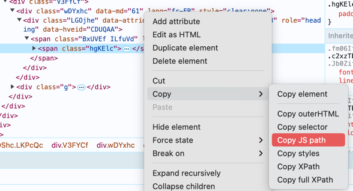

# Saxo Authentication Service

## First authentication request
This service is responsible for authenticating users with the O2Auth account of Saxo Bank you have registered for your application.

In order to authenticate, if lunch an headless Chrome that automatically done some action on the authentication website in order to obtain the token needed for the Saxo API.

## FAQ

Sometime Saxo add some more information to read and accept depending on the context of the day, or about your account. These movement aren't automated in this service. 

So for testing and add some automated movement, you can, comment the line `options.add_argument("--headless")`, lunch the script `src/saxo_authen/__init__.py` with `PYTHONUNBUFFERED=1;WATA_CONFIG_PATH=your_config.json` with pycharm bugger and add stop line on the line you think that will block the automated movement. 

On Chrome you can export JS path or XPath to add on the code. 

